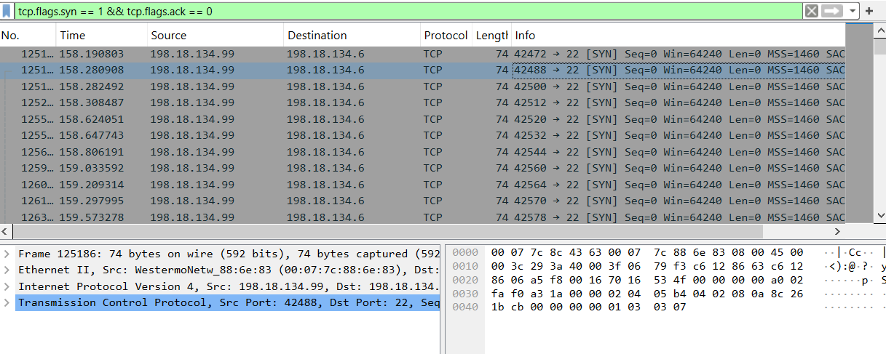
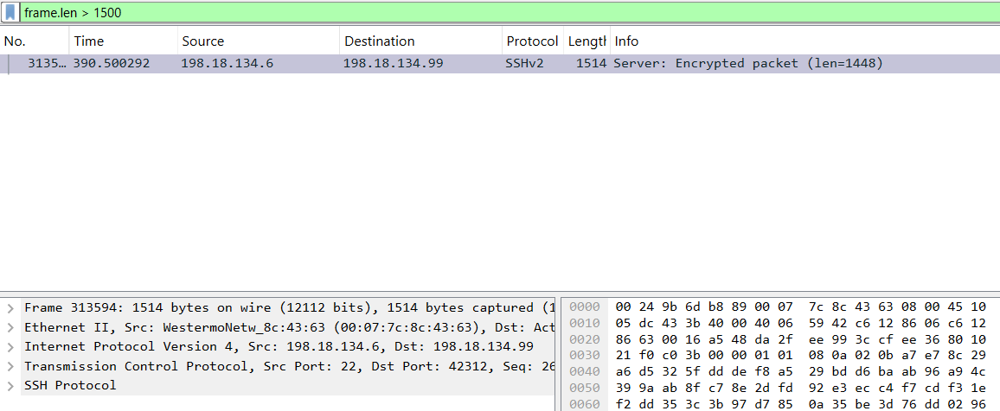
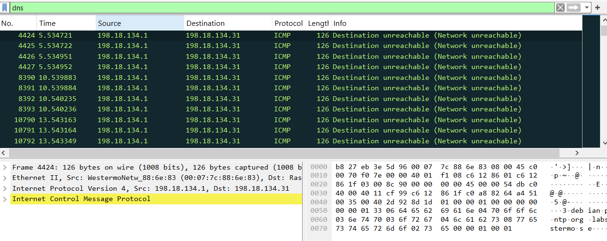
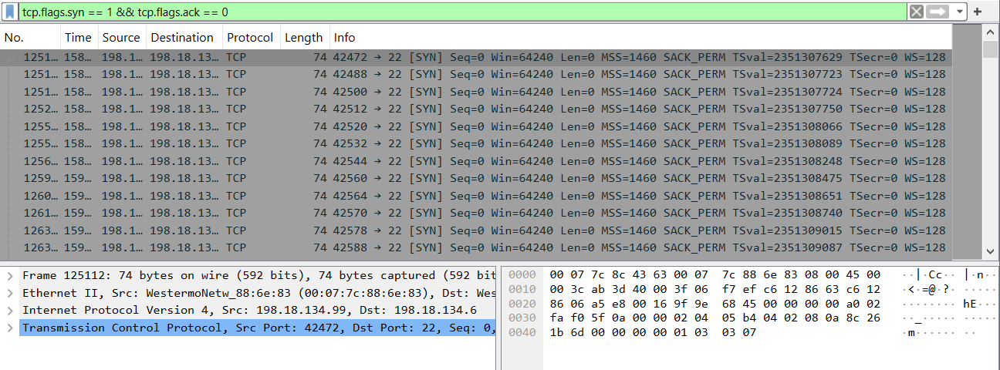

# 🧠 Network Traffic Analysis Report

## 🎯 Objective
Capture, filter, and analyze network traffic to distinguish between normal behavior and suspicious activity using Wireshark and Nmap.

---

## 📸 Captured Screenshots

### 1. SYN Packet Indicative of Port Scanning
  
> Captures a SYN packet with no ACK response, commonly seen in Nmap-style half-open scans. Filtered using `tcp.flags.syn == 1 && tcp.flags.ack == 0`.

---

### 2. Legitimate SSH Session Initialization
  
> Displays a completed TCP handshake followed by SSHv2 key exchange. Demonstrates how real encrypted sessions appear in contrast to scan attempts.

---

### 3. Malformed or Oversized Packet Detection
  
> Highlights packets with abnormal size or structure, useful for identifying protocol abuse or potential evasion techniques.

---

### 4. ICMP Echo Request (Ping) Traffic
  
> Shows standard ICMP echo requests and replies, useful as a baseline for comparison against more complex or suspicious traffic.

---

### 5. Traffic Spike Visualization (IO Graph)
  
> Wireshark IO Graph showing a burst of SYN packets over time — a visual indicator of scanning or flood behavior.

---

## 🧠 Observations

- **Normal traffic** included ICMP pings and completed SSH sessions.
- **Anomalous activity** was observed in the form of:
  - Half-open SYN packets (indicative of stealth scans)
  - Malformed packets and traffic spikes

---

## 🛡️ Mitigation Recommendations

- Restrict SSH access to trusted IPs and enforce key-based authentication.
- Monitor for SYN floods and malformed packets using IDS tools.
- Visualize traffic patterns regularly to detect anomalies early.

---

## 📂 Tools Used

- **Wireshark** for packet capture and filtering
- **Nmap** for generating controlled scan traffic
- **IO Graphs** for visualizing traffic spikes

---

